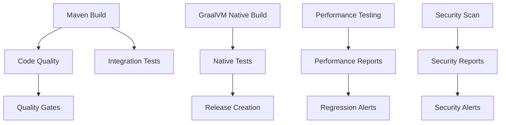

# GitHub Workflows

This directory contains GitHub Actions workflows for the WSO2 Micro Integrator GraalVM Edition project.

## Workflows Overview

### 1. Maven Build (`maven-build.yml`)

**Triggers:**
- Push to `main` or `develop` branches
- Pull requests to `main` or `develop` branches

**What it does:**
- Runs on Java 21 with Temurin distribution
- Compiles source code and runs unit tests
- Excludes performance tests for faster CI feedback
- Performs code quality analysis with SonarCloud
- Runs OWASP dependency vulnerability checks
- Executes integration tests
- Uploads test results and build artifacts

**Key Features:**
- Matrix build strategy for different Java versions (currently Java 21)
- Maven dependency caching for faster builds
- Test result reporting with detailed feedback
- Artifact preservation for downstream use

### 2. GraalVM Native Build (`graalvm-native.yml`)

**Triggers:**
- Push to `main` or `develop` branches
- Pull requests to `main` or `develop` branches
- Tags starting with `v*` (for releases)
- Weekly scheduled runs (Sundays at 2 AM UTC)

**What it does:**
- Builds native executables using GraalVM for Linux, macOS, and Windows
- Tests native executable functionality
- Measures executable size and basic performance
- Creates releases for tagged versions
- Provides performance feedback on pull requests

**Key Features:**
- Multi-platform builds (Linux, macOS, Windows)
- Native executable testing and verification
- Performance impact analysis for PRs
- Automatic release creation for tags
- Executable size and startup time monitoring

### 3. Performance Testing (`performance-testing.yml`)

**Triggers:**
- Push to `main` or `develop` branches
- Pull requests to `main` or `develop` branches
- Daily scheduled runs (3 AM UTC)
- Manual workflow dispatch with custom parameters

**What it does:**
- Runs comprehensive performance tests on both JVM and native builds
- Measures startup time, throughput, response time, memory usage
- Detects performance regressions against baselines
- Generates detailed performance reports
- Supports different test types: regular, stress, and custom

**Key Features:**
- Both JVM and native performance testing
- Regression detection with configurable thresholds
- Custom test parameters via workflow dispatch
- Performance comparison reports
- Automated alerts for performance issues
- PR comments with performance feedback

### 4. Security Scan (`security-scan.yml`)

**Triggers:**
- Push to `main` or `develop` branches
- Pull requests to `main` or `develop` branches
- Weekly scheduled runs (Mondays at 9 AM UTC)

**What it does:**
- Runs CodeQL analysis for Java code
- Performs vulnerability scanning with Trivy
- Scans for secrets using GitLeaks
- Generates license compliance reports

**Key Features:**
- Automated security vulnerability detection
- Secret scanning for credential leaks
- License compliance checking
- Integration with GitHub Security tab

## Configuration

### Environment Variables

The workflows use the following environment variables:

- `MAVEN_OPTS`: Maven JVM options for build optimization
- `GRAALVM_VERSION`: GraalVM version for native builds

### Secrets Required

For full functionality, configure these secrets in your repository:

- `GITHUB_TOKEN`: Automatically provided by GitHub
- `SONAR_TOKEN`: SonarCloud authentication token
- `GITLEAKS_LICENSE`: GitLeaks license (for organizations)

### Performance Test Configuration

Performance tests can be customized using system properties:

```bash
# Regular performance tests
mvn test -Pperformance-tests -Dtest=PerformanceBenchmarkTest

# Stress tests
mvn test -Pstress-tests -Dtest=PerformanceBenchmarkTest

# Custom configuration
mvn test -Pperformance-tests \
  -Dtest=PerformanceBenchmarkTest \
  -Dperformance.load.test.requests=2000 \
  -Dperformance.concurrent.threads=30
```

## Performance Baselines

The performance tests use these default baselines:

| Metric | Baseline | Description |
|--------|----------|-------------|
| Startup Time | < 5000ms | Maximum acceptable startup time |
| Throughput | > 100 RPS | Minimum requests per second |
| Response Time | < 50ms | Maximum average response time |
| Memory Usage | < 200MB | Maximum memory consumption |
| Error Rate | < 5% | Maximum acceptable error rate |

## Workflow Dependencies



## Artifact Retention

- **Test Results**: 30 days
- **Build Artifacts**: 30 days
- **Performance Reports**: 90 days
- **Security Reports**: 30 days
- **License Reports**: 30 days

## Monitoring and Alerts

### Performance Regression Detection

The performance workflow automatically:
- Compares results against baseline thresholds
- Creates GitHub issues for regressions on main branch
- Comments on PRs with performance feedback
- Generates detailed performance reports

### Security Vulnerability Alerts

Security workflows:
- Upload findings to GitHub Security tab
- Create alerts for high-severity issues
- Generate compliance reports

## Optimization Tips

### Build Performance
- Maven dependencies are cached across runs
- Test execution is parallelized where possible
- Performance tests are excluded from regular CI

### Native Build Performance
- GraalVM installation is cached
- Build artifacts are reused between steps
- Multi-platform builds run in parallel

### Resource Usage
- Workflows have appropriate timeouts
- Concurrent job limits prevent resource exhaustion
- Conditional execution reduces unnecessary runs

## Troubleshooting

### Common Issues

1. **Maven Build Failures**
   - Check Java version compatibility
   - Verify Maven cache is working
   - Review dependency conflicts

2. **Native Build Issues**
   - Ensure GraalVM native-image is installed
   - Check reflection configuration
   - Verify build environment setup

3. **Performance Test Failures**
   - Confirm server startup success
   - Check port availability (8290)
   - Review performance thresholds

4. **Security Scan Issues**
   - Verify secret tokens are configured
   - Check repository permissions
   - Review scan configurations

### Debug Mode

Enable verbose logging by adding `-X` to Maven commands:

```bash
mvn test -Pperformance-tests -Dtest=PerformanceBenchmarkTest -X
```

## Customization

### Adding New Test Types

To add new test categories:

1. Create new Maven profiles in `pom.xml`
2. Add corresponding workflow triggers
3. Update performance baselines if needed

### Extending Platform Support

To add new platforms for native builds:

1. Add platform to the matrix strategy
2. Configure platform-specific build steps
3. Update artifact naming conventions

### Custom Performance Metrics

To add new performance metrics:

1. Update `PerformanceBenchmarkTest.java`
2. Modify result parsing in workflows
3. Add new baseline thresholds

## Contributing

When modifying workflows:

1. Test changes in a fork first
2. Ensure backward compatibility
3. Update documentation
4. Verify all required secrets are documented
5. Test with different trigger conditions

## Support

For issues with GitHub workflows:

1. Check workflow run logs
2. Review repository settings
3. Verify required permissions
4. Consult GitHub Actions documentation
